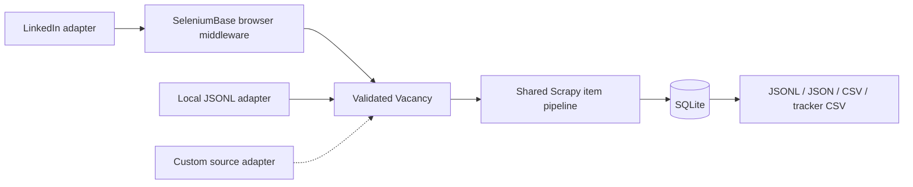

# Job Harvester

[](https://github.com/pol4xer/Job-Harvester/actions/workflows/checks.yml)

**A modular pipeline for collecting job vacancies, tracking changes and exporting useful datasets.**

Job Harvester separates source adapters from validation, persistence and export. LinkedIn collection uses Scrapy with a SeleniumBase browser session; a local JSONL adapter runs the same pipeline without a browser. New sources reuse the vacancy model, SQLite history and every exporter.

## Try it offline

Python **3.11–3.13** and [uv](https://docs.astral.sh/uv/) are required. No account, Chrome installation or API key is needed for the demo.

```bash
git clone https://github.com/pol4xer/Job-Harvester.git
cd Job-Harvester
uv sync --frozen
uv run --frozen job-harvester demo
uv run --frozen job-harvester stats --database data/demo/jobs.sqlite3
```

The demo imports four fictional records, including a duplicate:

```text
Offline demo complete. All records are fictional; no network or browser was used.
Processed: 4 records; exported: 3 unique jobs
```

It creates `data/demo/jobs.sqlite3` and `data/demo/vacancies.json`. Running it again adds a search run while keeping **three jobs and three content snapshots**. Inspect the [small input dataset](job_harvester/resources/demo_jobs.jsonl) or the [integration tests](tests/test_sources.py) to follow the entire path.

## Available sources

| Source | Input | Status |
| --- | --- | --- |
| `linkedin` | Search pages and job details | Implemented live adapter. Needs local Chrome; site access and selectors can change. Live collection is not exercised in CI. |
| `jsonl` | Local, newline-delimited JSON | Implemented offline adapter using the same Scrapy pipeline. |
| Other job boards or APIs | A custom Scrapy spider | Extension point; adapters for other websites are not included. |

```bash
uv run --frozen job-harvester list-sources
```

## Architecture



- **Source boundaries:** an explicit registry selects the spider and whether it needs a browser or an input file. Parsing stays outside storage and export.
- **Stable identity:** source-scoped keys and canonical URLs deduplicate observations without merging IDs from unrelated job boards.
- **Change history:** immutable content snapshots preserve changes; identical records reuse a snapshot. A later incomplete capture does not replace a complete description in exports.
- **Traceability:** separate search runs and hits record when and where a vacancy was discovered, including failed runs.
- **Efficient storage:** batched SQLite transactions, per-item savepoints and WAL mode avoid a commit for every vacancy.
- **Practical exports:** atomic file replacement, time/status filters and spreadsheet formula escaping. Raw captures are opt-in.

See [Adding a source](docs/adding-a-source.md) for a small working adapter. A new source does not require changing the database schema or exporters.

## Import and export

Each JSONL line is an object with at least `source_url`, `company` and `title`. Optional fields include `source_job_id`, `description`, `location`, `posted_at`, salary fields and capture status. The adapter assigns `source="jsonl"`, creates current run metadata and recomputes identity and content hashes.

```bash
uv run --frozen job-harvester crawl --source jsonl --input job_harvester/resources/demo_jobs.jsonl --database data/import/jobs.sqlite3
uv run --frozen job-harvester export --database data/import/jobs.sqlite3 --format csv --output data/exports/jobs.csv
uv run --frozen job-harvester export --database data/demo/jobs.sqlite3 --format tracker-csv --complete-only --output data/exports/tracker.csv
```

Malformed records make the command fail. Valid records already processed may remain stored, and the run is marked failed; imports are batched rather than all-or-nothing. Imported URLs are data and are never opened by the JSONL adapter.

Formats: `jsonl`, `json`, `csv`, and an English 26-column `tracker-csv`. Optional `tracker-csv-ru` preserves the previous Russian tracker format. Use `--since`, `--limit` and `--complete-only` to select records; `--include-raw` adds diagnostic capture data to JSON exports. Keep live exports private.

## LinkedIn collection

The live adapter handles Boolean search profiles, detail pages, bounded scrolling, incomplete captures and optional refresh of existing jobs. Manual login may be needed, and login/security challenges stop collection. Use it where you have permission to access and collect the data.

Copy the generic configuration for your own searches. Local overrides are ignored by Git:

```bash
cp config/searches.yaml config/searches.local.yaml
uv run --frozen job-harvester list-profiles --config config/searches.local.yaml
uv run --frozen job-harvester doctor --config config/searches.local.yaml
uv run --frozen job-harvester login --config config/searches.local.yaml
uv run --frozen job-harvester crawl --source linkedin --config config/searches.local.yaml --profile senior_python --max-results 25
```

Chrome is required for these commands. Edit keywords, location and filters in your local YAML. The default configuration is also bundled in the installed package. Its runtime paths resolve under the current working directory; a configuration in this checkout's `config/` uses the project root, and other custom configurations use their containing directory.

`run.py` is an editable IDE entry point for live collection and export. Copy it to `run.local.py` before adding personal settings. `scripts/debug_linkedin_scroll.py` is an explicit live browser diagnostic. Neither runs during tests.

## Development

```bash
make check  # Ruff, offline tests, wheel build and installed-package smoke check
make demo
```

Tests cover deduplication, changed snapshots, transaction rollback, handwritten parser fixtures, source registration, failed crawls, offline operation and export behavior. CI runs on Python 3.11, 3.12 and 3.13 and verifies that the wheel works outside the checkout. It does not log in to LinkedIn or test current website availability.

| Area | Modules in `job_harvester/` |
| --- | --- |
| Sources and orchestration | `sources.py`, `runner.py`, `spiders/` |
| Browser lifecycle and acquisition | `browser.py`, `middlewares.py` |
| Parsing and validation | `parsing.py`, `items.py`, `config.py` |
| Identity, transactions and history | `storage.py`, `pipelines.py` |
| Exports and CLI | `export.py`, `cli.py` |

## Local data

The repository contains source code, generic configuration and fictional fixtures. `.gitignore` excludes browser profiles and cookies, `.env` files, local configuration, diagnostic captures, databases and sidecars, exports, environments, editor settings and backups. `.env.example` documents process environment settings; `.env` is not loaded automatically, and explicit YAML/CLI settings take precedence.

Ignore rules do not remove previously committed data. Keep personal files in ignored locations and review staged changes before pushing. The public history starts with the sanitized portfolio version.
